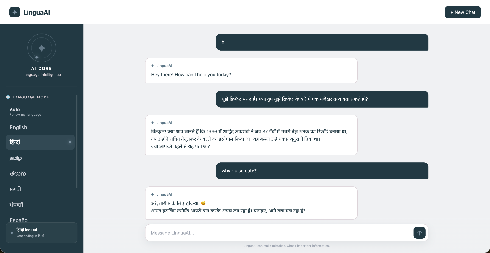

# LinguaAI

LinguaAI is a multilingual conversational AI chatbot that dynamically adapts to the language used by the user while maintaining conversation context across language switches.

The application uses a React frontend, Spring Boot backend, and Google Gemini API to generate context-aware responses in real time.

## Overview

LinguaAI allows users to have natural conversations without manually translating their messages.

In **Auto mode**, the chatbot responds in the language used in the user's current message while preserving the context of the ongoing conversation.

Users can also select a **specific language mode** when they want the assistant to respond only in a particular language.

## Demo

LinguaAI supports natural multilingual conversations while maintaining context across language switches.



## Features

- Multilingual conversational AI powered by Google Gemini API
- Automatic language adaptation based on the user's current message
- Specific language mode for controlled responses
- Conversation context maintained across language switches
- Real-time chat responses through a Spring Boot REST API
- Markdown rendering for AI responses
- Thinking/loading state while the AI generates a response
- New Chat option to reset the conversation
- Responsive and minimal chat-focused interface
- Graceful handling of backend and API failures

## Tech Stack

### Frontend

- HTML5
- CSS3
- JavaScript
- React
- Vite
- React Markdown

### Backend

- Java
- Spring Boot
- Spring Web
- Maven

### AI

- Google Gemini API

### Development Tools

- Git
- GitHub
- VS Code

## Architecture

```text
User
  │
  ▼
React Frontend
  │
  │ HTTP POST /api/chat
  ▼
Spring Boot Backend
  │
  │ Builds context-aware prompt
  ▼
Google Gemini API
  │
  │ AI-generated response
  ▼
Spring Boot Backend
  │
  ▼
React Frontend
  │
  ▼
User
```

The frontend manages the chat interface, selected language mode, and conversation state.

The Spring Boot backend receives the user's message and conversation history, constructs a context-aware prompt, and communicates with the Gemini API.

The generated response is returned through the backend and displayed in the React chat interface.

## How It Works

1. The user enters a message and optionally selects a language mode.
2. The React frontend sends the current message, selected language, and previous conversation messages to the Spring Boot backend.
3. The backend builds a prompt containing:
   - Assistant behavior and response style
   - Selected language mode
   - Conversation history
   - Current user message
4. The backend sends the prompt to the Google Gemini API.
5. Gemini generates a context-aware response following the requested language behavior.
6. The backend returns the generated response to the frontend.
7. React displays the response in the chat interface.

### Language Handling

LinguaAI supports two language modes:

- **Auto:** The AI responds in the language used in the user's current message.
- **Specific Language:** The AI responds only in the language selected by the user.

Because the previous conversation is included with each request, the AI can maintain context even when the user switches languages during the conversation.

## Project Structure

```text
lingua-ai/
│
├── backend/
│   ├── src/
│   │   ├── main/
│   │   │   ├── java/com/linguaai/backend/
│   │   │   │   ├── controller/
│   │   │   │   │   └── ChatController.java
│   │   │   │   │
│   │   │   │   ├── dto/
│   │   │   │   │   ├── ChatRequest.java
│   │   │   │   │   └── ConversationMessage.java
│   │   │   │   │
│   │   │   │   └── service/
│   │   │   │       └── GeminiService.java
│   │   │   │
│   │   │   └── resources/
│   │   │       └── application.properties
│   │   │
│   │   └── test/
│   │
│   └── pom.xml
│
├── frontend/
│   ├── src/
│   │   ├── App.jsx
│   │   ├── App.css
│   │   ├── index.css
│   │   └── main.jsx
│   │
│   ├── package.json
│   └── vite.config.js
│
├── .gitignore
└── README.md
```

### Backend Components

- `ChatController` exposes the `/api/chat` REST endpoint.
- `ChatRequest` stores the current message, selected language, and conversation history.
- `ConversationMessage` represents individual user and assistant messages.
- `GeminiService` builds the prompt and communicates with the Google Gemini API.

### Frontend Components

- `App.jsx` manages the chatbot interface, messages, language selection, and API communication.
- `App.css` contains the main application styling.
- `main.jsx` initializes the React application.

## API

### Chat Endpoint

```text
POST /api/chat
```

### Request

```json
{
  "message": "What is recursion?",
  "language": "Auto",
  "conversation": [
    {
      "role": "user",
      "content": "What is recursion?"
    }
  ]
}
```

### Response

```text
Recursion is a programming technique where a function calls itself...
```

## Setup & Installation

### Prerequisites

Make sure you have the following installed:

- Java 17+
- Node.js
- npm
- Google Gemini API key

### 1. Clone the Repository

```bash
git clone https://github.com/shreyasrivastava11/lingua-ai.git
cd lingua-ai
```

### 2. Configure the Gemini API Key

Set your Gemini API key as an environment variable.

#### macOS / Linux

```bash
export GEMINI_API_KEY="your-api-key"
```

#### Windows

```bash
set GEMINI_API_KEY=your-api-key
```

Do not commit your API key to the repository.

### 3. Start the Backend

Open a terminal in the project root:

```bash
cd backend
./mvnw spring-boot:run
```

The backend will start on:

```text
http://localhost:8080
```

### 4. Start the Frontend

Open another terminal:

```bash
cd frontend
npm install
npm run dev
```

The frontend will start on:

```text
http://localhost:5173
```

Open the frontend URL in your browser and start chatting with LinguaAI.

## Error Handling

LinguaAI includes basic error handling for backend and Gemini API failures.

If the Gemini API is temporarily unavailable or an API request fails, the backend returns a user-friendly message instead of exposing the underlying API error to the user.

## Future Improvements

- Persistent conversation history
- PostgreSQL database integration
- User conversation management
- Production deployment
- Streaming AI responses
- Additional language support
- Improved API error handling
- Conversation history search

## Learning Outcomes

This project was built to gain practical experience with:

- Generative AI API integration
- Prompt engineering
- Context-aware conversations
- Multilingual AI applications
- REST API development
- React state management
- Frontend-backend communication
- Environment variable management
- Git and GitHub workflow

## Author

**Shreya Srivastava**

GitHub: [@shreyasrivastava11](https://github.com/shreyasrivastava11)